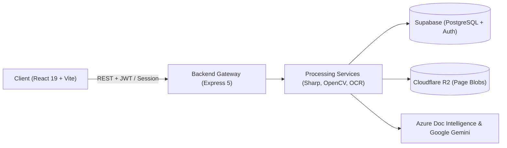

# System Architecture (Living Draft)

> [!NOTE]
> **Status: Initial Draft (Living Document) — captures baseline architecture during active development.**

---

## 1. Document Status & System Overview

**Arkhive** is an intelligent document processing web application that transforms photos and scanned documents (receipts, financial statements, tabular forms, and multi-page PDFs) into structured, editable, and exportable data. The stack consists of a **React 19 / TypeScript / Vite** single-page application and a **Node.js 22 / Express 5 / TypeScript** backend, backed by **Supabase** (PostgreSQL with Row-Level Security and Supabase Auth), **Cloudflare R2** (S3-compatible object storage), **Azure Document Intelligence** (layout analysis), and **Google Gemini** (LLM tabular structuring, schema mapping, and interactive verification chat).

The complete system architecture and end-to-end data pipelines are visualized in [`ARCHITECTURE_DIAGRAM.mmd`](file:///Users/simon/Desktop/Uni/Engineering/2026/FIT3170/2026W1-Arkhive/ARCHITECTURE_DIAGRAM.mmd). The flow starts when a user uploads document pages in the frontend (split client-side via PDF.js), which are preprocessed with Sharp/OpenCV and stored in Cloudflare R2; pages are then processed through Azure Document Intelligence and Gemini to extract bounding-box-linked tables for side-by-side interactive validation.



---

## 2. Repository Layout (Top-Level)

The repository is structured as a decoupled full-stack workspace with independent frontend and backend packages coordinated by root-level tooling and Docker configurations:

```text
2026W1-Arkhive/
├── .github/              # GitHub Actions CI workflows for test execution, docker builds, and security scans
├── .husky/               # Git pre-commit hooks enforcing lint-staged and formatting
├── backend/              # Node.js/Express API service, OCR pipeline, LLM integrations, and Supabase migrations
├── docs/                 # Documentation, specifications, and User Acceptance Testing (UAT) materials
├── frontend/             # React 19 single-page application built with Vite, Tailwind CSS v4, and DaisyUI
├── Dockerfile            # Multi-stage container definition compiling frontend assets into backend public dir
├── cloudbuild.yaml       # Google Cloud Build deployment configuration targeting Google Cloud Run
├── package.json          # Root configuration managing repository-wide dev dependencies (Husky, Prettier, ESLint)
└── ARCHITECTURE_DIAGRAM.mmd # Standalone Mermaid.js diagram illustrating component topology and request flows
```

- **`.github/`**: Houses automated CI pipelines (`ci.yml`) running unit tests, integration tests, container builds, and Trivy security audits.
- **`.husky/`**: Automates pre-commit code verification to ensure formatting and linting pass before code reaches git history.
- **`backend/`**: Contains the Express REST API, database access layers, cloud storage integrations, image analysis, and OCR/LLM services.
- **`docs/`**: Stores supplementary documentation, acceptance criteria, and operational guides.
- **`frontend/`**: Contains the client-side user interface, interactive table editors, document viewer, and AI assistant panels.
- **`Dockerfile`**: Defines the two-stage production container build (frontend Vite build stage + Node 22 backend runtime).
- **`cloudbuild.yaml`**: Provides automated CI/CD deployment instructions for Google Cloud Run.
- **`package.json`**: Coordinates root developer dependencies, lint-staged commands, and workspace-wide formatting scripts.
- **`ARCHITECTURE_DIAGRAM.mmd`**: Provides the primary Mermaid-syntax architecture diagram referenced by this document.

---

## 3. Frontend Breakdown (`frontend/`)

The frontend is a single-page application built with **React 19**, **TypeScript**, and **Vite**, styled with **Tailwind CSS v4** and **DaisyUI 5**. It features client-side PDF rasterization (`pdfjs-dist`), side-by-side document/table comparison, in-cell data editing with undo/redo history, and a Gemini-powered verification assistant.

### Directory Roles

| Folder Path                                                                                                                   | What Lives Here                                                                                                                                                                                                                                                                                                                                                                                                                                                                  | Newcomer Rule of Thumb                                                                                 |
| :---------------------------------------------------------------------------------------------------------------------------- | :------------------------------------------------------------------------------------------------------------------------------------------------------------------------------------------------------------------------------------------------------------------------------------------------------------------------------------------------------------------------------------------------------------------------------------------------------------------------------- | :----------------------------------------------------------------------------------------------------- |
| [`frontend/src/pages/`](file:///Users/simon/Desktop/Uni/Engineering/2026/FIT3170/2026W1-Arkhive/frontend/src/pages)           | Route-level views (`home`, `login`, `projects`, `upload`, `validation`) and page-specific sub-layouts.                                                                                                                                                                                                                                                                                                                                                                           | Top-level orchestrators only; manage high-level view state and compose shared components.              |
| [`frontend/src/components/`](file:///Users/simon/Desktop/Uni/Engineering/2026/FIT3170/2026W1-Arkhive/frontend/src/components) | Shared cross-page UI components including [`AuthGuard`](file:///Users/simon/Desktop/Uni/Engineering/2026/FIT3170/2026W1-Arkhive/frontend/src/components/auth/AuthGuard.tsx), [`RequireUser`](file:///Users/simon/Desktop/Uni/Engineering/2026/FIT3170/2026W1-Arkhive/frontend/src/components/auth/RequireUser.tsx), and [`Navbar`](file:///Users/simon/Desktop/Uni/Engineering/2026/FIT3170/2026W1-Arkhive/frontend/src/components/navbar/Navbar.tsx).                           | Stateless or layout-focused UI; no direct backend API fetching or route transitions.                   |
| [`frontend/src/context/`](file:///Users/simon/Desktop/Uni/Engineering/2026/FIT3170/2026W1-Arkhive/frontend/src/context)       | Global React Context providers (specifically [`AuthProvider`](file:///Users/simon/Desktop/Uni/Engineering/2026/FIT3170/2026W1-Arkhive/frontend/src/context/AuthProvider.tsx) and [`AuthContext`](file:///Users/simon/Desktop/Uni/Engineering/2026/FIT3170/2026W1-Arkhive/frontend/src/context/AuthContext.ts)).                                                                                                                                                                  | Reserved for truly global state (active user credentials, session tokens, and guest mode flag).        |
| [`frontend/src/hooks/`](file:///Users/simon/Desktop/Uni/Engineering/2026/FIT3170/2026W1-Arkhive/frontend/src/hooks)           | Custom React hooks managing complex local workflows (`useTableEditor`, `useUndoRedo`, `useProjects`, `useReviewQueue`).                                                                                                                                                                                                                                                                                                                                                          | Encapsulate mutable state logic, keyboard handlers, and undo/redo stacks; avoid rendering markup.      |
| [`frontend/src/services/`](file:///Users/simon/Desktop/Uni/Engineering/2026/FIT3170/2026W1-Arkhive/frontend/src/services)     | Network API clients ([`documentService`](file:///Users/simon/Desktop/Uni/Engineering/2026/FIT3170/2026W1-Arkhive/frontend/src/services/documentService.ts), [`projectService`](file:///Users/simon/Desktop/Uni/Engineering/2026/FIT3170/2026W1-Arkhive/frontend/src/services/projectService.ts), [`uploadService`](file:///Users/simon/Desktop/Uni/Engineering/2026/FIT3170/2026W1-Arkhive/frontend/src/services/uploadService.ts)) and export utilities (`batchExportService`). | All HTTP requests and file blob downloads belong here; keep decoupled from React component lifecycles. |
| [`frontend/src/utils/`](file:///Users/simon/Desktop/Uni/Engineering/2026/FIT3170/2026W1-Arkhive/frontend/src/utils)           | Pure data transformation functions (`flattener.ts`, `fileGrouping.ts`, `tableOperations.ts`, format regex detectors).                                                                                                                                                                                                                                                                                                                                                            | Pure, deterministic utility functions only; must be free of side effects and easy to unit test.        |
| [`frontend/src/models/`](file:///Users/simon/Desktop/Uni/Engineering/2026/FIT3170/2026W1-Arkhive/frontend/src/models)         | Shared frontend TypeScript interfaces and domain schemas (`Project.ts`, `TableData.ts`, `IssueReview.ts`, `OCRComponent.ts`).                                                                                                                                                                                                                                                                                                                                                    | Type definitions and data contracts only; no runtime implementation code.                              |
| [`frontend/src/mock-data/`](file:///Users/simon/Desktop/Uni/Engineering/2026/FIT3170/2026W1-Arkhive/frontend/src/mock-data)   | Static fixtures for tests and offline development (sample bounding boxes, test PDFs).                                                                                                                                                                                                                                                                                                                                                                                            | Test fixture assets only; never bundle into production execution paths.                                |
| [`frontend/public/`](file:///Users/simon/Desktop/Uni/Engineering/2026/FIT3170/2026W1-Arkhive/frontend/public)                 | Public assets, web manifests, favicons, and export format iconography.                                                                                                                                                                                                                                                                                                                                                                                                           | Static files served directly without bundling; referenced by root path (e.g. `/icons.svg`).            |

### State Management & API Communication Conventions

1. **Authentication & Session State:**
   - Managed globally by [`AuthProvider`](file:///Users/simon/Desktop/Uni/Engineering/2026/FIT3170/2026W1-Arkhive/frontend/src/context/AuthProvider.tsx).
   - Authenticated sessions obtain a Supabase JWT stored by the Supabase client.
   - Unauthenticated users can choose "Continue as Guest", setting `arkhive_guest_mode` in `sessionStorage` to access ephemeral upload and validation views without an account.
2. **Page & Component State:**
   - Ephemeral UI state (selected cells, hovered bounding boxes, zoom levels, review queue indexes) is handled by local React state and specialized custom hooks ([`useTableEditor`](file:///Users/simon/Desktop/Uni/Engineering/2026/FIT3170/2026W1-Arkhive/frontend/src/hooks/useTableEditor.ts), [`useUndoRedo`](file:///Users/simon/Desktop/Uni/Engineering/2026/FIT3170/2026W1-Arkhive/frontend/src/hooks/useUndoRedo.ts), [`useReviewQueue`](file:///Users/simon/Desktop/Uni/Engineering/2026/FIT3170/2026W1-Arkhive/frontend/src/hooks/review/useReviewQueue.ts)).
3. **Backend Communication:**
   - All network calls flow through functions in [`frontend/src/services/`](file:///Users/simon/Desktop/Uni/Engineering/2026/FIT3170/2026W1-Arkhive/frontend/src/services).
   - Functions automatically attach the current Supabase JWT Bearer token to request headers via `getAuthHeaders()` when interacting with authenticated routes.
   - The base URL is configured via [`apiBase.ts`](file:///Users/simon/Desktop/Uni/Engineering/2026/FIT3170/2026W1-Arkhive/frontend/src/services/apiBase.ts), which defaults to relative `/api/*` paths during local development and production (proxied by Vite or served by Express).

---

## 4. Backend Breakdown (`backend/`)

The backend is built with **Node.js 22**, **Express 5**, and **TypeScript**, executed with `tsx`. It coordinates image preprocessing, cloud storage, optical character recognition, and generative AI queries.

### Request Progression & Architectural Layers

```text
HTTP Request
     │
     ▼
[Middleware Layer] ──> requireAuth (Supabase JWT) / express-session / multer (Memory/Disk)
     │
     ▼
[Routing Layer]    ──> /api/projects, /api/documents, /api/upload, /api/extraction, /api/llm, /api/qr
     │
     ▼
[Controller Layer] ──> Input validation, user authorization checks, response status formatting
     │
     ▼
[Service Layer]    ──> imageProcessor (Sharp/OpenCV), r2Client (S3), ocr (Azure + Gemini), aiService
     │
     ▼
[Persistence/Ext]  ──> Supabase PostgreSQL (via Service Role Client), Cloudflare R2, Azure DI, Gemini API
```

| Folder Path                                                                                                                           | What Lives Here                                                                                                                                                                                                                                                                                                                                                                                                                                                                                                                                                                                                                                                                                                                | Layer / Flow Stage                 |
| :------------------------------------------------------------------------------------------------------------------------------------ | :----------------------------------------------------------------------------------------------------------------------------------------------------------------------------------------------------------------------------------------------------------------------------------------------------------------------------------------------------------------------------------------------------------------------------------------------------------------------------------------------------------------------------------------------------------------------------------------------------------------------------------------------------------------------------------------------------------------------------- | :--------------------------------- |
| [`backend/app.ts`](file:///Users/simon/Desktop/Uni/Engineering/2026/FIT3170/2026W1-Arkhive/backend/app.ts)                            | Root server process entrypoint. Binds port listener, imports Express app, and runs periodic cleanup of ephemeral upload directories.                                                                                                                                                                                                                                                                                                                                                                                                                                                                                                                                                                                           | **Server Runtime Entrypoint**      |
| [`backend/src/app.ts`](file:///Users/simon/Desktop/Uni/Engineering/2026/FIT3170/2026W1-Arkhive/backend/src/app.ts)                    | Express instance configuration. Mounts body parsers, sessions, API route groups, static frontend serving, and SPA route fallback.                                                                                                                                                                                                                                                                                                                                                                                                                                                                                                                                                                                              | **Application Bootstrap**          |
| [`backend/src/middleware/`](file:///Users/simon/Desktop/Uni/Engineering/2026/FIT3170/2026W1-Arkhive/backend/src/middleware)           | Request interceptors, prominently [`auth.ts`](file:///Users/simon/Desktop/Uni/Engineering/2026/FIT3170/2026W1-Arkhive/backend/src/middleware/auth.ts) (`requireAuth`). Verifies Supabase Bearer JWTs and populates `req.userId`.                                                                                                                                                                                                                                                                                                                                                                                                                                                                                               | **Security & Authentication**      |
| [`backend/src/routes/`](file:///Users/simon/Desktop/Uni/Engineering/2026/FIT3170/2026W1-Arkhive/backend/src/routes)                   | Express route definitions ([`documentRoutes`](file:///Users/simon/Desktop/Uni/Engineering/2026/FIT3170/2026W1-Arkhive/backend/src/routes/documentRoutes.ts), [`projectRoutes`](file:///Users/simon/Desktop/Uni/Engineering/2026/FIT3170/2026W1-Arkhive/backend/src/routes/projectRoutes.ts), [`llmRoutes`](file:///Users/simon/Desktop/Uni/Engineering/2026/FIT3170/2026W1-Arkhive/backend/src/routes/llmRoutes.ts), [`upload`](file:///Users/simon/Desktop/Uni/Engineering/2026/FIT3170/2026W1-Arkhive/backend/src/routes/upload.ts), [`qr`](file:///Users/simon/Desktop/Uni/Engineering/2026/FIT3170/2026W1-Arkhive/backend/src/routes/qr.ts)). Multer upload policies are configured here.                                  | **Routing & Payload Ingestion**    |
| [`backend/src/controller/`](file:///Users/simon/Desktop/Uni/Engineering/2026/FIT3170/2026W1-Arkhive/backend/src/controller)           | Request controllers ([`documents.ts`](file:///Users/simon/Desktop/Uni/Engineering/2026/FIT3170/2026W1-Arkhive/backend/src/controller/documents.ts), [`projects.ts`](file:///Users/simon/Desktop/Uni/Engineering/2026/FIT3170/2026W1-Arkhive/backend/src/controller/projects.ts), [`llm.ts`](file:///Users/simon/Desktop/Uni/Engineering/2026/FIT3170/2026W1-Arkhive/backend/src/controller/llm.ts), [`upload.ts`](file:///Users/simon/Desktop/Uni/Engineering/2026/FIT3170/2026W1-Arkhive/backend/src/controller/upload.ts), [`qrController.ts`](file:///Users/simon/Desktop/Uni/Engineering/2026/FIT3170/2026W1-Arkhive/backend/src/controller/qrController.ts)). Handles parameter validation and orchestrates domain calls. | **Controller & Validation Layer**  |
| [`backend/src/services/`](file:///Users/simon/Desktop/Uni/Engineering/2026/FIT3170/2026W1-Arkhive/backend/src/services)               | Core business logic: [`imageProcessor.ts`](file:///Users/simon/Desktop/Uni/Engineering/2026/FIT3170/2026W1-Arkhive/backend/src/services/imageProcessor.ts), [`r2Client.ts`](file:///Users/simon/Desktop/Uni/Engineering/2026/FIT3170/2026W1-Arkhive/backend/src/services/r2Client.ts), [`ocrPreprocessor.ts`](file:///Users/simon/Desktop/Uni/Engineering/2026/FIT3170/2026W1-Arkhive/backend/src/services/ocrPreprocessor.ts), [`supabaseClient.ts`](file:///Users/simon/Desktop/Uni/Engineering/2026/FIT3170/2026W1-Arkhive/backend/src/services/supabaseClient.ts), [`qrService.ts`](file:///Users/simon/Desktop/Uni/Engineering/2026/FIT3170/2026W1-Arkhive/backend/src/services/qrService.ts).                            | **Domain & Integration Services**  |
| [`backend/src/services/ocr/`](file:///Users/simon/Desktop/Uni/Engineering/2026/FIT3170/2026W1-Arkhive/backend/src/services/ocr)       | OCR execution engine. Integrates Azure Document Intelligence (`prebuilt-layout`), fallback mocks (`mockOcrFixture.ts`), and Gemini-driven bounding box hydration (`experimental.ts`).                                                                                                                                                                                                                                                                                                                                                                                                                                                                                                                                          | **OCR & Computer Vision Pipeline** |
| [`backend/src/services/llm/`](file:///Users/simon/Desktop/Uni/Engineering/2026/FIT3170/2026W1-Arkhive/backend/src/services/llm)       | Large Language Model service (`aiService.ts`). Interfaces with Gemini for chat verification, cell correction suggestions, and table format regex detection.                                                                                                                                                                                                                                                                                                                                                                                                                                                                                                                                                                    | **LLM & Prompt Orchestration**     |
| [`backend/src/models/`](file:///Users/simon/Desktop/Uni/Engineering/2026/FIT3170/2026W1-Arkhive/backend/src/models)                   | Backend data models and interfaces (`Project.ts`, `TableData.ts`, `IssueReview.ts`, `Job.ts`, `QrSession.ts`, `message.ts`).                                                                                                                                                                                                                                                                                                                                                                                                                                                                                                                                                                                                   | **Data Models & Contracts**        |
| [`backend/supabase/migrations/`](file:///Users/simon/Desktop/Uni/Engineering/2026/FIT3170/2026W1-Arkhive/backend/supabase/migrations) | Canonical SQL migration scripts for Supabase PostgreSQL tables, indexes, triggers, and Row Level Security policies.                                                                                                                                                                                                                                                                                                                                                                                                                                                                                                                                                                                                            | **Database Schema & Migrations**   |
| [`backend/uploads/`](file:///Users/simon/Desktop/Uni/Engineering/2026/FIT3170/2026W1-Arkhive/backend/uploads)                         | Ephemeral disk storage destination for guest uploads and QR mobile camera captures.                                                                                                                                                                                                                                                                                                                                                                                                                                                                                                                                                                                                                                            | **Temporary File Storage**         |

### Background Tasks & Middleware Details

- **Authentication Middleware ([`requireAuth`](file:///Users/simon/Desktop/Uni/Engineering/2026/FIT3170/2026W1-Arkhive/backend/src/middleware/auth.ts)):** Validates the Supabase Auth access token passed in the `Authorization: Bearer <token>` header, querying `supabase.auth.getUser()`. If valid, binds the authenticated Supabase user UUID to `req.userId`.
- **Session Cleanup Worker:** Defined in [`backend/app.ts`](file:///Users/simon/Desktop/Uni/Engineering/2026/FIT3170/2026W1-Arkhive/backend/app.ts), a background interval runs every 12 hours (`cleanupOldUploads()`) removing any session folders in `backend/uploads/` older than 3 days.
- **Multipart File Handling:** Multer is configured differently depending on route purpose:
  - In [`documentRoutes.ts`](file:///Users/simon/Desktop/Uni/Engineering/2026/FIT3170/2026W1-Arkhive/backend/src/routes/documentRoutes.ts): Uses `multer.memoryStorage()` so uploaded page buffers can be analyzed in-memory by Sharp and OpenCV before being streamed directly to Cloudflare R2.
  - In [`upload.ts`](file:///Users/simon/Desktop/Uni/Engineering/2026/FIT3170/2026W1-Arkhive/backend/src/routes/upload.ts) & [`qr.ts`](file:///Users/simon/Desktop/Uni/Engineering/2026/FIT3170/2026W1-Arkhive/backend/src/routes/qr.ts): Uses `multer.diskStorage()` targeting `backend/uploads/{sessionId}/{documentId}/` for guest/mobile uploads.

---

## 5. Dual Workflow Architecture: Cloud vs. Guest/Session

Arkhive supports two primary execution pipelines:

```text
┌────────────────────────────────────────────────────────────────────────┐
│                        AUTHENTICATED CLOUD FLOW                        │
│ User Login ──> /projects ──> /api/documents/upload-page                │
│                                  │                                     │
│                                  ├──> Sharp/OpenCV Quality Analysis    │
│                                  ├──> Cloudflare R2 (Persistent PNG)   │
│                                  └──> Supabase DB (document_pages row) │
│                                  │                                     │
│               POST /api/documents/process (OCR + Gemini)               │
│                                  │                                     │
│               PATCH /api/documents/:id/pages/:idx/data (Save edits)   │
└────────────────────────────────────────────────────────────────────────┘

┌────────────────────────────────────────────────────────────────────────┐
│                        EPHEMERAL GUEST & QR FLOW                       │
│ Guest Mode / Mobile QR Scan ──> /upload ──> /api/upload/page           │
│                                  │                                     │
│                                  ├──> Multer Disk Storage (uploads/)   │
│                                  └──> Express Session (req.session)    │
│                                  │                                     │
│               POST /api/upload/process (OCR + Gemini)                  │
│                                  │                                     │
│               POST /api/extraction (Save edits to session)             │
└────────────────────────────────────────────────────────────────────────┘
```

1. **Persistent Cloud Pipeline (`/projects` & `/api/documents`):**
   - Requires Supabase user authentication.
   - Files are stored in Cloudflare R2 at `{owner_id}/{project_id}/{document_id}/page-{index}.png`.
   - Records are stored across `projects`, `documents`, and `document_pages` tables in PostgreSQL with strict Row Level Security.
   - Preserves state across browser sessions and crashes.
2. **Ephemeral Guest & Mobile Flow (`/upload` & `/api/upload` / `/api/qr`):**
   - Requires no Supabase login.
   - Mobile phones capture pictures via QR code token ([`MobileCapture.tsx`](file:///Users/simon/Desktop/Uni/Engineering/2026/FIT3170/2026W1-Arkhive/frontend/src/pages/upload/MobileCapture.tsx)) and upload to the desktop user's local session directory on the backend server.
   - Results are held in `req.session` and temporary files are pruned after 3 days.

---

## 6. Shared Packages & Infrastructure

### Infrastructure & Deployment Setup

- **Multi-Stage Docker Build ([`Dockerfile`](file:///Users/simon/Desktop/Uni/Engineering/2026/FIT3170/2026W1-Arkhive/Dockerfile)):**
  - **Stage 1 (`frontend-build`):** Installs frontend dependencies using `node:22`, injects public Supabase build arguments (`VITE_SUPABASE_URL`, `VITE_SUPABASE_ANON_KEY`), and compiles the production bundle with `vite build` into `frontend/dist`.
  - **Stage 2 (Runtime):** Uses `node:22`, installs backend dependencies, copies backend code, copies the compiled frontend assets from Stage 1 into `backend/public/`, exposes port 3000, and boots the server using `npx tsx app.ts`.
- **Continuous Integration ([`.github/workflows/ci.yml`](file:///Users/simon/Desktop/Uni/Engineering/2026/FIT3170/2026W1-Arkhive/.github/workflows/ci.yml)):**
  - **Frontend Jobs:** Executes ESLint, TypeScript typecheck (`tsc -b`), production build verification, and Vitest unit tests.
  - **Backend Jobs:** Executes ESLint, TypeScript compilation check (`tsc --noEmit`), and Vitest unit tests.
  - **Integration Tests:** Boots integration test suites for backend and frontend using dummy credentials and mock OCR fixtures.
  - **Container & Security Audit:** Builds the Docker image and scans both the container filesystem and dependencies using **Aquasecurity Trivy**, uploading SARIF reports to GitHub Security.
- **Continuous Deployment ([`cloudbuild.yaml`](file:///Users/simon/Desktop/Uni/Engineering/2026/FIT3170/2026W1-Arkhive/cloudbuild.yaml)):**
  - Executes container build via Google Cloud Build.
  - Pushes image tag to Google Container Registry (`${_IMAGE}:${COMMIT_SHA}`).
  - Deploys container to **Google Cloud Run** in the designated region.

---

## 7. "Where Do I Put...?" Decision Matrix

Use this cheat sheet to orient yourself when introducing new features, changes, or integrations into the repository:

| Developer Question                                              | Target Location                                                                                                                                                                                                                                                                                                 | Relevant Files & Conventions                                                                                                                                                                                                                                                                                                                                                                                                                                                                          |
| :-------------------------------------------------------------- | :-------------------------------------------------------------------------------------------------------------------------------------------------------------------------------------------------------------------------------------------------------------------------------------------------------------- | :---------------------------------------------------------------------------------------------------------------------------------------------------------------------------------------------------------------------------------------------------------------------------------------------------------------------------------------------------------------------------------------------------------------------------------------------------------------------------------------------------- |
| **"Where do I add a new API endpoint?"**                        | [`backend/src/routes/`](file:///Users/simon/Desktop/Uni/Engineering/2026/FIT3170/2026W1-Arkhive/backend/src/routes) & [`backend/src/controller/`](file:///Users/simon/Desktop/Uni/Engineering/2026/FIT3170/2026W1-Arkhive/backend/src/controller)                                                               | Define route and HTTP verb in `routes/<resource>Routes.ts`. Implement handler in `controller/<resource>.ts`. If authenticated, apply `requireAuth` middleware. Wire route group in [`backend/src/app.ts`](file:///Users/simon/Desktop/Uni/Engineering/2026/FIT3170/2026W1-Arkhive/backend/src/app.ts).                                                                                                                                                                                                |
| **"Where do I add a new UI page or screen?"**                   | [`frontend/src/pages/`](file:///Users/simon/Desktop/Uni/Engineering/2026/FIT3170/2026W1-Arkhive/frontend/src/pages) & [`frontend/src/App.tsx`](file:///Users/simon/Desktop/Uni/Engineering/2026/FIT3170/2026W1-Arkhive/frontend/src/App.tsx)                                                                    | Create a folder in `frontend/src/pages/<name>/`. Register the path in [`App.tsx`](file:///Users/simon/Desktop/Uni/Engineering/2026/FIT3170/2026W1-Arkhive/frontend/src/App.tsx) wrapped in `<AuthGuard />` (allows guests) or `<RequireUser />` (requires registered account).                                                                                                                                                                                                                        |
| **"Where do I add a new database table or schema change?"**     | [`backend/supabase/migrations/`](file:///Users/simon/Desktop/Uni/Engineering/2026/FIT3170/2026W1-Arkhive/backend/supabase/migrations)                                                                                                                                                                           | Add a timestamped `.sql` file in `backend/supabase/migrations/`. Always enable Row Level Security (`alter table ... enable row level security`), define `using` and `with check` policies referencing `auth.uid()`, and update corresponding models in [`backend/src/models/`](file:///Users/simon/Desktop/Uni/Engineering/2026/FIT3170/2026W1-Arkhive/backend/src/models) and [`frontend/src/models/`](file:///Users/simon/Desktop/Uni/Engineering/2026/FIT3170/2026W1-Arkhive/frontend/src/models). |
| **"Where do I add a new document export format?"**              | [`frontend/src/services/`](file:///Users/simon/Desktop/Uni/Engineering/2026/FIT3170/2026W1-Arkhive/frontend/src/services) & [`ExportModal.tsx`](file:///Users/simon/Desktop/Uni/Engineering/2026/FIT3170/2026W1-Arkhive/frontend/src/pages/validation/components/extracted-data/ExportModal.tsx)                | Implement format serializer in `frontend/src/services/<format>DownloadService.ts`. Register format in [`batchExportService.ts`](file:///Users/simon/Desktop/Uni/Engineering/2026/FIT3170/2026W1-Arkhive/frontend/src/services/batchExportService.ts) and add the UI option to [`ExportModal.tsx`](file:///Users/simon/Desktop/Uni/Engineering/2026/FIT3170/2026W1-Arkhive/frontend/src/pages/validation/components/extracted-data/ExportModal.tsx).                                                   |
| **"Where do I add a new image quality heuristic or OCR step?"** | [`backend/src/services/imageProcessor.ts`](file:///Users/simon/Desktop/Uni/Engineering/2026/FIT3170/2026W1-Arkhive/backend/src/services/imageProcessor.ts) & [`ocrPreprocessor.ts`](file:///Users/simon/Desktop/Uni/Engineering/2026/FIT3170/2026W1-Arkhive/backend/src/services/ocrPreprocessor.ts)            | Add blur/lighting/contrast analysis inside `imageProcessor.ts` using OpenCV or Sharp and append flags to `QualityFlags`. For pre-OCR enhancements (e.g. sharpening, thresholding), edit `ocrPreprocessor.ts`.                                                                                                                                                                                                                                                                                         |
| **"Where do I integrate a new LLM prompt or AI tool?"**         | [`backend/src/services/llm/aiService.ts`](file:///Users/simon/Desktop/Uni/Engineering/2026/FIT3170/2026W1-Arkhive/backend/src/services/llm/aiService.ts) & [`frontend/src/services/llmService.ts`](file:///Users/simon/Desktop/Uni/Engineering/2026/FIT3170/2026W1-Arkhive/frontend/src/services/llmService.ts) | Add prompt generation, schema declarations, and Gemini API calls to `aiService.ts`. Expose endpoint via [`backend/src/routes/llmRoutes.ts`](file:///Users/simon/Desktop/Uni/Engineering/2026/FIT3170/2026W1-Arkhive/backend/src/routes/llmRoutes.ts) and add client method in `llmService.ts`.                                                                                                                                                                                                        |

---

## 8. 🙌 Acknowledgements

_This document and the companion architecture diagram ([`ARCHITECTURE_DIAGRAM.mmd`](file:///Users/simon/Desktop/Uni/Engineering/2026/FIT3170/2026W1-Arkhive/ARCHITECTURE_DIAGRAM.mmd)) were developed with assistance from Google Gemini._
